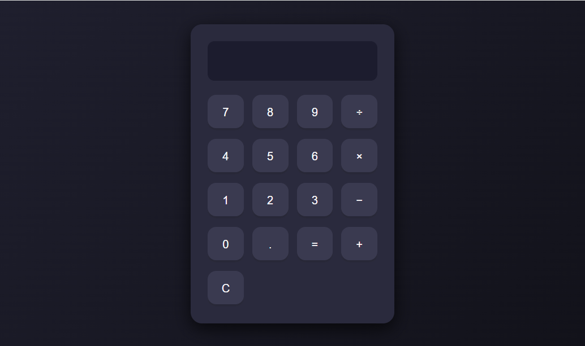

# 🧮 Calculadora em JavaScript

Uma calculadora simples e moderna desenvolvida com **HTML, CSS e JavaScript**, com **modo escuro**, layout responsivo e suporte a teclado físico.



---

## ✨ Funcionalidades

- ✅ Operações básicas: `+`, `-`, `×`, `÷`
- ✅ Avaliação da expressão com `eval()`
- ✅ Suporte ao teclado físico
- ✅ Modo escuro moderno com design limpo
- ✅ Totalmente responsiva para mobile e desktop

---

## 🛠️ Como rodar localmente

```bash
# Clone o repositório
git clone https://github.com/GiovaniLenoir/calculadora-js.git

# Acesse a pasta
cd calculadora-js

# Abra o arquivo no navegador
start index.html   # No Windows
# ou
open index.html    # No Mac

## 🧪 Tecnologias usadas

- HTML5
- CSS3
- JavaScript ES6
- Git + GitHub

---

## 📸 Captura de tela

Abaixo está a imagem preview.png usada no topo para mostrar a aparência da calculadora.


---

## 📄 Licença

Uso livre para fins educacionais e projetos pessoais.
- Desenvolvido com ❤️ por Giovani Lenoir.
